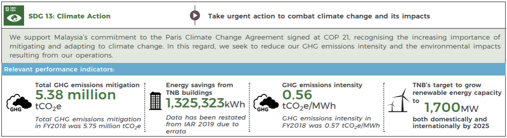
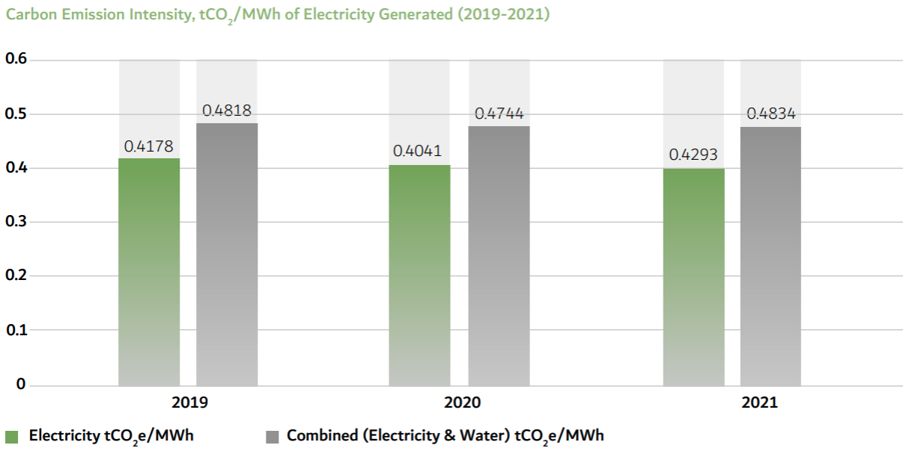

# Worked example: inspectability in practice (Q1)

**Question 1** asks how Tenaga Nasional and DEWA compare on emissions-intensity reduction from 2019 to their most recent reported year, both in absolute terms (tCO₂e/MWh) and percentage terms, and whether the two rankings agree. The ground-truth answer is:

> DEWA's intensity fell from 0.4178 to 0.4045 tCO₂e/MWh (−0.0133, −3.18%). TNB's intensity fell from 0.56 to 0.5571 tCO₂e/MWh (−0.0029, −0.52%). Both rankings agree: DEWA reduced more.

Both pipelines scored *partial* in the v1 benchmark (correct ranking, wrong figures). The point of this case study is not which pipeline scored higher, but what each pipeline's per-step reasoning lets us **diagnose**, **iterate on**, and **learn from** when both pipelines fail. The intermediate sub-step answers are persisted in `steps.answer`; the analysis below reads them directly.

## v1 multi-step (run 48, Qwen3-235B): two diagnosable failures

The LtM decomposition produced ten sub-questions. Steps 5–10 are arithmetic and deterministic given their inputs, so any wrong final figure must enter at Steps 1–4 (the value-extraction sub-questions).

**Step 1 — "What was TNB's emissions intensity in 2019?"** The intermediate answer was:

> *"Tenaga Nasional's emissions intensity in 2019 was 0.57 tCO2e/MWh (TNB Sustainability Report 2019, p.19)."*

The top-ranked chunk was `TNB_2019_chunk_0094`. The source page (p.19 of the 2019 sustainability report) is an infographic with four performance-indicator boxes; the GHG-intensity box shows *0.56 tCO₂e/MWh* as the headline FY2019 figure, with *"GHG emissions intensity in FY2018 was 0.57 tCO2e/MWh"* as small contextual sub-text. 

The PDF extraction tagged the infographic as an `Image` element and ran OCR over it, which produced unparseable garbage — *"(wise MNO 1325523. Bl corer «te GHG 2 i ' ' : SGHG 2 : 1,700mw"* in the chunk text. **The 0.56 is missing from the chunk entirely.** The only intensity figure present is the restatement footnote: *"Data has been restated [...] from IAR 2019 due to errata [...] FY2018 was 0.57 tCOze/MWh"*.

So the v1 failure is a clean model hallucination: the model picked up the only intensity figure it could parse (0.57) and bound it to the 2019 question, ignoring the chunk's explicit FY2018 label.

A separate chunk, `TNB_2019_chunk_0215` (p.50), contains the figure in clean tabular form (*"Emissions intensity | tCO₂e/MWh | 0.54 | 0.57 | 0.56"* for FY2017 / FY2018 / FY2019), and would have given the model an unambiguous source. **Step 1's retrieval did not surface it** — chunk_0094 ranked higher.

**Step 3 — "What was DEWA's emissions intensity in 2019?"** The intermediate answer was:

> *"DEWA's emissions intensity in 2019 was 0.4818 tCO₂e/MWh (DEWA Sustainability Report 2021, p.89)."*

The cited chunk (`DEWA_2021_chunk_0448`) contains a multi-series chart whose data includes both 0.4178 (Electricity tCO₂e/MWh) and 0.4818 (Combined Electricity & Water tCO₂e/MWh) for 2019. The bar values and the legend text were both extracted, but the spatial association between each value and its series label was lost — in the chunk text the numbers appear next to year sequences with no unambiguous mapping to electricity-only vs combined classifications. 

**The model picked 0.4818 without noting 0.4178 was also present**, and without disambiguating which series was the carbon-performance comparable to TNB's electricity-only number.

The two failures are both extraction-side, of distinct sub-types: TNB's is **OCR failure on an infographic image** (the headline figure missing entirely from the chunk text); DEWA's is **structure loss in chart extraction** (the bar values preserved as text, but the value-to-label mapping lost). Both expose the same general problem: the source pages encode information in visual structures the PDF-to-text pipeline cannot preserve.

Steps 5–8 carried these wrong endpoints forward through deterministic arithmetic. Steps 9–10 reached the correct conclusion (DEWA reduced more on both, measures agree) on wrong inputs.

For each of the eight wrong intermediate figures, the persisted `steps.answer` row identifies the sub-step in which it was introduced and the citation the model wrote at the time. That is the diagnostic surface this case study is about — and what makes the prompt iteration described next possible.

## v2 prompt iteration: testing whether prompt engineering can fix the diagnosed failures

The v2 prompt changes live on the `prompt-v2` branch; main remains at the v1 prompts that produced the 24 runs in the benchmark and report. The two v1 failures suggested two specific additions to `SUBQ_USER_PROMPT`. The existing prompt already contained an anti-ambiguity rule for charts with value-year sequences (e.g. *"0.4178 0.4041 0.4293 labelled 2019-2021"*), but did not cover the two patterns observed in Q1:

1. **Multi-series same-year ambiguity** — when a chart contains multiple distinct values for the same year (electricity-only vs combined electricity-and-water).
2. **Year-label vs question-year mismatch** — when a chunk's only available figure is labelled with a different year than the sub-question asks about (FY2018 figure in answer to an FY2019 question).

We added one bullet for each pattern, with concrete examples drawn from the failures, and re-ran Q1 for both models. Results are mixed in a way that itself is informative.

### v2 run 67 (Qwen3-235B): the year-label rule fires; the multi-series rule does not

**Step 1 — v2 intermediate answer:**

> *"Tenaga Nasional's emissions intensity in 2019 is not directly stated in the retrieved passages. The only emissions intensity value provided is for FY2018, which was 0.57 tCO₂e/MWh (TNB Sustainability Report 2019, p.19). [...] the emissions intensity for 2019 cannot be determined from the provided information."*

The year-label rule fired cleanly, and the refusal is **fully accurate about the chunk**: chunk_0094's text contains only the FY2018 restatement value, and the v2 model correctly identifies this and declines to commit to a 2019 figure. The refusal propagated through Steps 5, 6, 9, 10 — all of which now abstain on TNB-side comparisons rather than computing reductions from a fabricated endpoint. The prompt fix landed at the layer it could reach (model commitment); it cannot reach upstream into extraction, where the headline 0.56 was lost.

The v2 refusal also implicitly surfaces the retrieval failure as a question worth asking: a developer reading *"only FY2018 is available in the retrieved chunk"* can immediately ask *"why didn't retrieval find a chunk that does have FY2019?"* — leading them to `chunk_0215`. v1's confident *"0.57 for 2019"* foreclosed that investigation.

**Step 3 — v2 intermediate answer:**

> *"DEWA's emissions intensity in 2019 was 0.4818 tCO₂e/MWh for electricity generated [...] This value corresponds to the 'Electricity tCO₂e/MWh' metric, which is the carbon-performance comparable measure."*

The model still picked 0.4818 and still claimed it is the electricity-only figure (it is not — 0.4178 is). The multi-series rule did not fire because the model did not perceive the chunk as containing multiple series — the legend's spatial association to bar values was stripped at extraction time, so the chunk text gives no signal that two series exist.

### v2 run 68 (Qwen3-30B): neither rule fires

Step 1 v2 returned the v1 answer verbatim: *"Tenaga Nasional's emissions intensity in 2019 was 0.57 tCO2e/MWh (TNB Sustainability Report 2019, p.19)."* No FY2018 flag, no hedge. Step 3 likewise gave the v1 answer with no multi-series flag. The 30B model received the same prompt and ignored both new rules.

## What the v2 iteration reveals

**(1) Prompt-rule compliance is model-capacity-dependent.** Same prompt, same retrieved chunks; 235B applied the year-label rule and 30B did not. 

**(2) The most consequential failure modes are upstream of the prompt layer.** Q1's two errors trace to two distinct extraction failures: OCR garbage in an infographic image (TNB), and value-to-label mapping loss in a chart (DEWA). No prompt rule recovers information that was lost during PDF-to-text conversion. v2's multi-series rule could only fire if the model perceived the chunk as multi-series; the chunk gives no signal that it is. Fixing this requires upstream changes to the extraction step.

**(3) v1 hallucination collapses three distinct upstream failures into one confident wrong answer; v2 honesty exposes them as separable.** v1's *"0.57"* hides the joint contribution of:

- **Retrieval:** ranked the OCR-degraded chunk (`chunk_0094`, image element, only FY2018 in plain text) above the clean tabular chunk (`chunk_0215`, p.50, all years explicit). The clean chunk exists in the corpus and the retriever did not surface it.
- **Extraction:** failed to OCR the infographic image on p.19. The headline 0.56 — present and unambiguous in the source PDF — is absent from the chunk text. 
- **Model in v1:** committed to 0.57 as the 2019 figure despite the chunk's explicit *"FY2018 was 0.57"* qualifier. This is a hallucination — not caused by ambiguity in the chunk but by the model overriding the chunk's year label to fit the question.

v1's single confident answer cannot be decomposed back into these three contributing causes. v2's per-step refusal **separates what the model commits to from what the chunk actually says**, and that separation in turn exposes the retrieval and extraction failures as distinct, separately addressable problems.

This is the case study's central argument for inspectability: structured per-step persistence, combined with intermediate-answer inspection, lets a developer attribute failures to specific upstream stages and target fixes there. Single-shot's one row with one prose answer cannot support this decomposition.

## Comparison with single-shot (run 60, Qwen3-235B)

Single-shot's intermediate answer — also its final answer — runs ~350 words with explicit chain-of-thought. Two things are notable.

**First**, single-shot/235B hedged on the combined-vs-electricity ambiguity:

> *"the 2019 value is for combined (electricity & water), while the 2023 value is for electricity only. This is a different metric and may not be directly comparable."*

The model then attempted to resolve the hedge and landed on 0.4818 — also wrong, but with the right uncertainty surfaced first. The same 235B model that hedged in single-shot mode did *not* hedge in multi-step v1 mode, because closed-form sub-question framing (*"What was DEWA's emissions intensity in 2019?"*) suggests a single answer exists. Multi-step v2 partially recovered this by adding explicit ambiguity rules, but the recovery was incomplete (year-label rule fired, multi-series rule did not, even for the same 235B model).

**Second**, single-shot's endpoint choice was inconsistent across companies (TNB 2022 = 0.55 paired with DEWA 2023 = 0.3979, neither at 2024). This is a *coordination* failure that multi-step avoids by definition — Step 2 explicitly asks for TNB 2024 and Step 4 explicitly asks for DEWA 2024.

Importantly, single-shot's larger retrieval pool (40 chunks vs multi-step's 10-per-sub-question) included `chunk_0215` and the model used it: *"TNB 2019 = 0.56 tCO2e/MWh (TNB Sustainability Report 2019, p.50)"*. The same corpus, the same model — different retrieval scope, different access to the clean chunk. This corroborates the retrieval-miss finding empirically: the right answer is in the corpus; multi-step's narrower per-sub-question retrieval is what missed it.

## A scoring-rubric tension

The v2 235B run highlights a tension in the categorical scoring rubric. By the de facto rule used in v1 scoring, refusal where GT is determinate is *incorrect*; v2 235B refuses to compare TNB's reduction because the chunk it retrieved (chunk_0094) does not contain a parsable 2019 figure, so v2 would score *incorrect* — a regression from v1's *partial* (wrong figures, right conclusion). Yet v2 is more *faithful* to the retrieved evidence: the chunk's text really contains only an FY2018 figure, and the model's refusal correctly identifies this. 

## What this means for trustworthiness, and for the TPI use case

With regards to the question — *does multi-step improve trustworthiness even where accuracy is similar?* — this case study supports an answer: yes, on the dimensions of **structural traceability** (each fact attributable to a specific sub-step), **prompt-level fixability** (failure modes diagnosed in per-step logs translate into concrete prompt changes that can be tested in hours), and **separation of upstream failure modes** (model hallucination vs retrieval miss vs extraction-side data loss are distinguishable, each addressable in its own pipeline stage). These are the dimensions that matter most for a TPI analyst reviewing the system's output before publishing a finding.

It also surfaces costs honestly: decomposition can suppress the spontaneous uncertainty signalling that single-shot prompting elicits (run 60 hedged where run 48 did not); prompt-rule compliance is model-capacity-dependent (235B applied the v2 rules, 30B did not); and the most consequential failure modes here — OCR failures on infographic images, structure loss in chart extraction — are not addressable at the prompt or architectural layer at all. They require upstream changes to extraction and chunking, out of scope for this project but well-defined as next steps.
