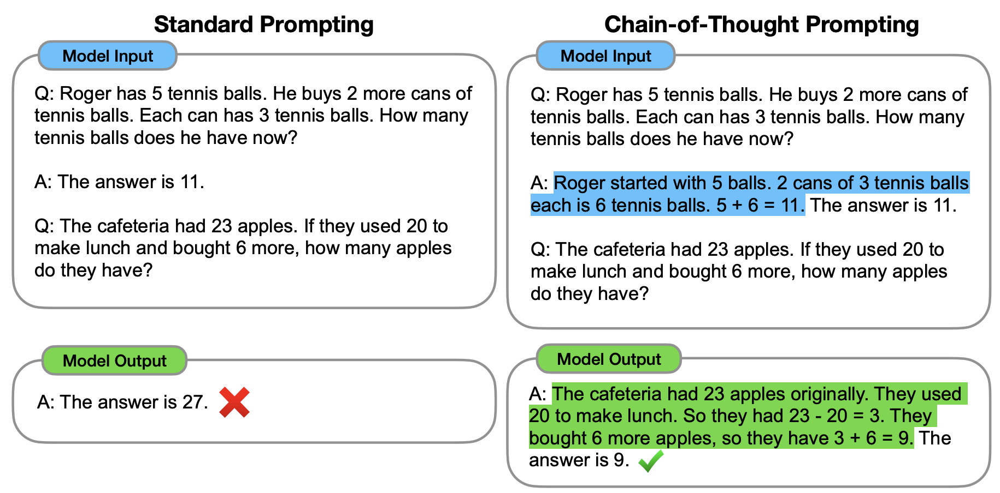
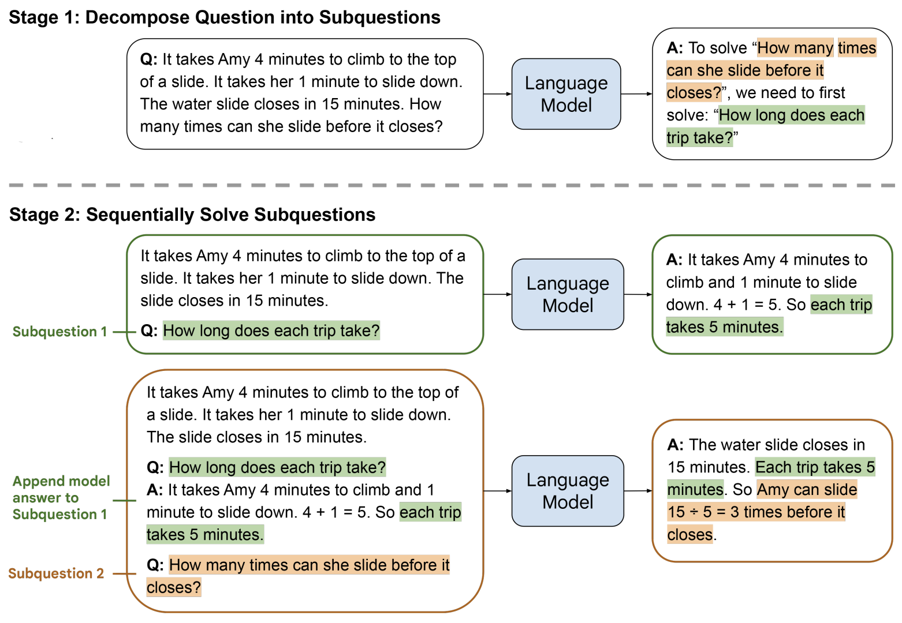
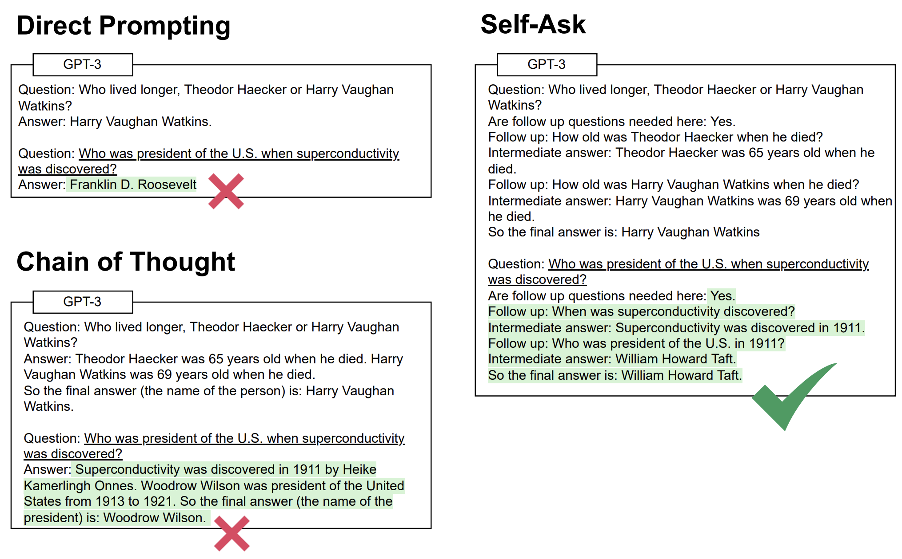
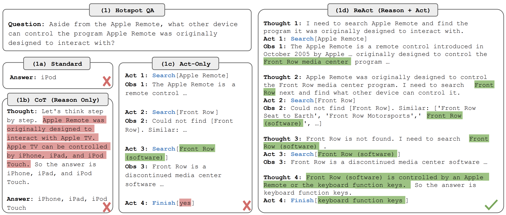

# Query Decomposition: Research Notes

This document reviews query decomposition techniques considered for the multi-step RAG pipeline in Project C. The goal is to select an approach that (a) allows an LLM to reason dynamically about how to break down a complex Carbon Performance question, (b) persists intermediate results to a database for auditability, and (c) is feasible within a $100 NEBIUS compute budget.

## Techniques Reviewed

### 1. Chain-of-Thought (CoT) Prompting
**Paper:** [Wei et al., NeurIPS 2022](https://arxiv.org/abs/2201.11903) 

The model is prompted to show its reasoning step by step ("think step by step") before giving a final answer. Reasoning happens *inside a single LLM call* — no retrieval between steps, no database, no intermediate persistence.

**In the context of this project:**

Pros:

- Zero additional retrieval cost — useful as a prompting technique *within* each sub-step of a more complex pipeline
- Improves reasoning quality over plain prompting with no architectural changes needed

Cons:

- Still a single LLM call — intermediate reasoning steps exist only as generated text, not as independently verifiable database records
- Cannot identify which reasoning step introduced an error when the final answer is wrong
- No retrieval between steps, so the model reasons entirely from whatever chunks were retrieved upfront — problematic for questions requiring evidence scattered across a long report
- Not a decomposition strategy on its own; most relevant as a description of what the single-shot baseline is doing

---

### 2. Least-to-Most Prompting
**Paper:** [Zhou et al., ICLR 2023](https://arxiv.org/abs/2205.10625) 

A two-phase approach: 

* **Phase 1 (decomposition):** a single LLM call prompts the model to break the complex question into an ordered list of sub-questions, from simplest to most dependent. 
* **Phase 2 (sequential solving):** each sub-question is answered in order, with previous answers available as context for the next call.

The key design principle: sub-questions are *dependent* — later ones are deliberately harder and build on earlier answers.

**In the context of this project:**

Pros:
- Clean two-phase structure maps directly onto a database schema: one decomposition record, one record per sub-step, one assembly record
- The LLM generates the decomposition dynamically, so it adapts to different question structures without hard-coded sub-questions
- Cost is predictable — each question produces exactly N+1 calls (decomposition + one per sub-question + assembly)
- Trajectory questions (extract 2019 figure → extract 2020 → ... → assess trend) are naturally suited to the "simpler to harder" ordering
- Since the benchmark question set is fixed and known in advance, LLM-generated decompositions can be reviewed before running the full pipeline, reducing the risk of bad sub-questions

Cons:
- Decomposition is planned upfront without retrieval — the model may generate sub-questions that don't map well onto what is actually retrievable from the documents
- Error propagation: if an early sub-answer is wrong, later sub-questions inherit that error
- Less adaptive for comparative questions (e.g. extracting the same figure across three companies) where sub-steps don't meaningfully build on each other

---

### 3. Self-Ask
**Paper:** [Press et al., 2023](https://arxiv.org/abs/2210.03350) 

The model is prompted to ask itself follow-up questions explicitly ("Do I need to follow up? Yes. Follow-up question: ..."). Each follow-up triggers a retrieval call; the result is fed back before the next follow-up is generated. Unlike Least-to-Most, the decomposition *emerges incrementally* — the next sub-question is only generated after seeing the answer to the previous one.

**In the context of this project:**

Pros:
- More adaptive than LtM: the model adjusts what it asks next based on what it has already found, reducing the risk of planning sub-questions that don't match document content
- Each follow-up question + retrieval + answer cycle is a natural unit to write to the database
- Handles cases where the right next question only becomes clear after seeing an intermediate answer

Cons:
- The decomposition structure is implicit and less predictable — harder to inspect whether the decomposition itself was sensible
- Stopping condition is ambiguous: the model decides when it has "enough" information, which can vary unpredictably across questions
- Slightly harder to implement cleanly than LtM due to the less structured output format

---

### 4. ReAct (Reasoning + Acting)
**Paper:** [Yao et al., ICLR 2023](https://arxiv.org/abs/2210.03629)
 
ReAct interleaves reasoning traces ("I need to find X") with actions ("Search for X") and observations ("Search returned Y") in a repeating cycle, with each cycle being a separate LLM call. The model dynamically decides what to retrieve next based on accumulated evidence. 
 
> The pattern: Thought → Action → Observation → Thought → Action → Observation → ... → Answer

**In the context of this project:**

Pros:
- Most flexible approach — the model decides dynamically what to retrieve at each step, adapting to whatever it finds in the documents
- The explicit Thought → Action → Observation structure maps naturally to database rows making auditing easy
- Well-established with existing implementations (e.g. LangChain's zero-shot ReAct agent) that can be adapted to use a custom vector store instead of the Wikipedia API used by the original paper
- Closest to genuine agentic reasoning — likely to produce the most interesting benchmark results and the strongest report narrative

Cons:
- Retrieval calls can multiply unpredictably if the model keeps deciding it needs more information — harder to estimate token cost in advance
- Most complex to implement correctly: requires careful prompt design, tool definition, and a robust stopping condition
- Higher risk of exceeding the $100 NEBIUS budget on complex questions if not validated on a small model first

---
 
## Summary Comparison
 
| Technique | Decomposition timing | # LLM calls | Retrieval per step | DB schema fit | Budget predictability |
|---|---|---|---|---|---|
| CoT | Inside single call | 1 | No | Poor | High |
| Least-to-Most | Upfront, then sequential | N+1 | Yes | Good | High |
| Self-Ask | Incremental | N (variable) | Yes | Good | Medium |
| ReAct | Incremental | N (variable) | Yes | Good | Low–Medium |

---

## Recommendation

**Adopt Least-to-Most (LtM) prompting as the primary decomposition strategy.**

The core requirement of this project is a multi-step pipeline whose intermediate results are persisted, inspectable, and auditable. LtM satisfies this more cleanly than the alternatives for the following reasons:

- **Structural fit:** The two-phase structure (one decomposition call, then sequential sub-question execution) maps directly and predictably onto the SQLite schema. Each phase produces clearly bounded database records, making failure attribution straightforward.

- **Question type fit:** The benchmark question set consists primarily of trajectory and change-over-time questions, where earlier sub-steps (extracting a single year's figure) enable later ones (assessing trend or computing change). This is exactly the problem LtM was designed for.

- **Budget predictability:** With a fixed $100 NEBIUS budget, LtM's deterministic call count (N+1 per question) is a meaningful advantage over ReAct and Self-Ask, where the number of retrieval calls can grow unpredictably. Budget risk is low and estimable in advance.

- **Fixed question set mitigates LtM's main weakness:** LtM's known limitation is that it plans sub-questions without seeing the documents. This matters most for open-ended or unpredictable queries. Since the benchmark question set is fixed and known in advance, the LLM-generated decompositions can be reviewed and corrected before any NEBIUS tokens are spent, effectively eliminating this risk.

- **Implementation simplicity:** A working end-to-end pipeline can be built and validated on Nuvolos with a small model before switching to NEBIUS, reducing the chance of burning budget on debugging.

**If time and budget allow**, ReAct is the recommended second strategy to trial. Its explicit Thought → Action → Observation structure is the most transparent for auditing, and comparing it against LtM would strengthen the report's conclusions. 