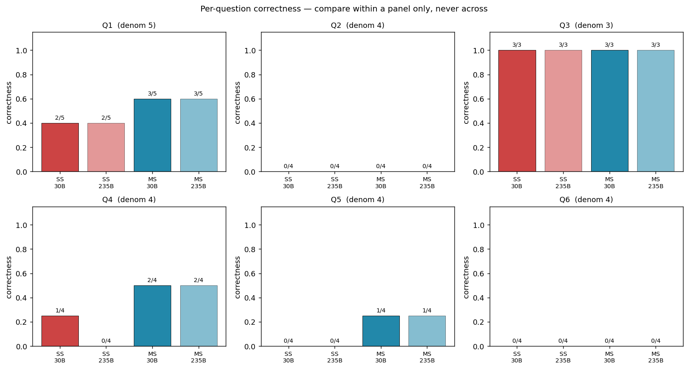
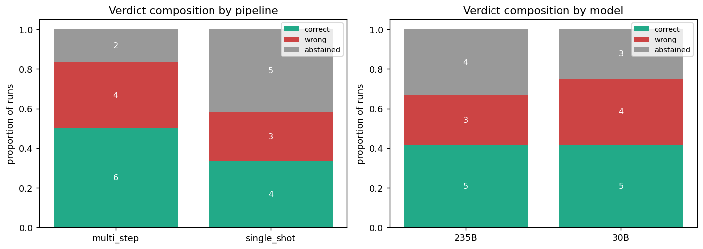
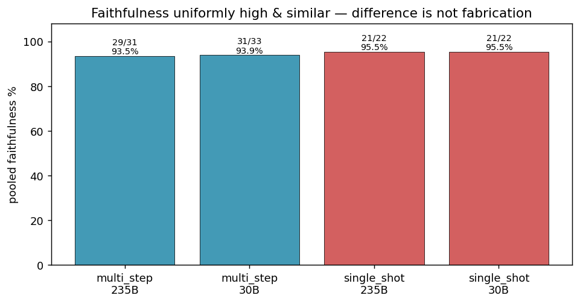
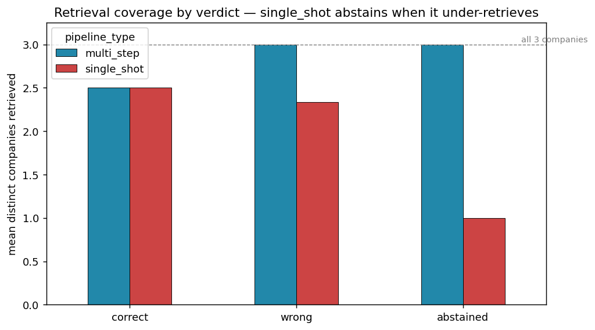
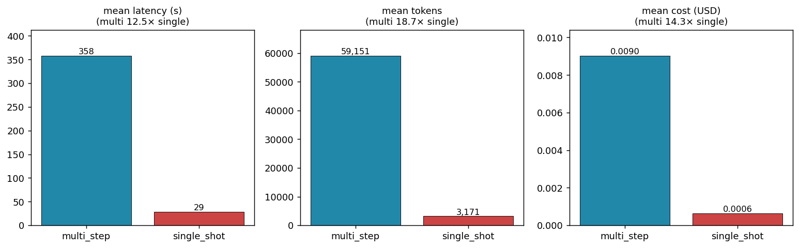

# Project C - Benchmark Report: Single-shot vs Multi-step RAG for Carbon Performance

## 1. Summary

Multi-step query decomposition weakly dominates single-shot on correctness for Carbon Performance questions — better on the synthesis questions (Q1, Q4, Q5), never worse anywhere — but the modest accuracy gain is not the main finding. Decomposition's real effect is behavioural: it converts abstentions into committed answers (single-shot abstained on 5 of 12 runs, multi-step on 2), and because every sub-step is persisted, those commitments are auditable in a way single-shot's single-call output is not. Faithfulness is high and near-identical across both pipelines (~94%), so the difference is not hallucination; where answers are numerically wrong, the cause is almost always corrupted retrieved text from PDF extraction, not model invention. These gains come at roughly an order-of-magnitude cost: multi-step runs ~14x more expensive, ~12–13x slower, and uses ~19x the tokens. Model size barely moved results — pipeline choice mattered more than scaling from 30B to 235B, so multi-step@30B is a more sensible investment than single-shot@235B for these question types. Recommendation: adopt multi-step decomposition selectively, for complex high-stakes questions where auditability justifies the cost, and keep single-shot for simple lookups.

## 2. Methodology

### 2.1 Question set & classification

**Sector and companies.** Electrical Utilities sector, intensity metric = Scope 1 / MWh of electricity generated; chosen because Scope 1 is the most consistently and clearly disclosed of the available sectors. Three companies - DEWA, CenterPoint Energy, Tenaga Nasional (TNB) - each with multiple years of sustainability reports, supporting the trajectory and change-over-time question types.

**Ground truth.** Six questions were written *before* building either pipeline. Ground-truth answers were derived manually from the source PDFs, with page numbers, section titles, and chunk IDs recorded for traceability. Two team members cross-checked each answer independently before the set was frozen and committed.

**Classification (primary scheme).** Rather than the brief's three suggested types as a rigid 2+2+2, the set is classified on the two axes that actually predict performance:

1. **Retrieval scope** - single-company vs cross-company.
2. **Answer operation** - retrieve-and-state vs synthesis (trajectory / comparative) vs derived computation.

The brief's three types (Trajectory / Comparative / Change-over-time) are retained only as a secondary coverage note, applied honestly to allow hybrids.

| Q | Scope | Core operation | Brief-type (coverage) | Primary class |
|---|---|---|---|---|
| Q1 | 2 companies | Compute each company's change over time, then compare | Comparative | Comparative + trajectory (synthesis) |
| Q2 | 3 companies | Derive required annual rate per company, then rank | Comparative | Derived computation |
| Q3 | 1 company | Enumerate stated targets | (labelled Trajectory) | Retrieve-and-state |
| Q4 | 1 company | Assess multi-year intensity series + net change | Trajectory | Trajectory (synthesis) |
| Q5 | 3 companies | Compare stated targets across report vintages | Change-over-time | Change-over-time (synthesis) |
| Q6 | 3 companies | Derive actual vs required rate, judge credibility | (labelled Change-over-time) | Derived computation |

Note: Q3 lists targets with no intensity time-series; Q6 is a trajectory-credibility comparison, not a change in target wording. Both sit differently from their brief-type label, which is why the two-axis scheme is primary.

**Why this scheme carries the argument.** It maps onto the results where the brief's types do not: the derived-computation questions (Q2, Q6) score 0 for every configuration (neither pipeline did the required-rate arithmetic); the single retrieve-and-state question (Q3) is the only one all 24 runs got right (an easy control); and the synthesis questions (Q1, Q4, Q5) are exactly where multi-step weakly dominates.

### 2.2 The two pipelines

Both pipelines share their data preparation and retrieval stack so that the only experimental variables are pipeline structure and model size. The shared components are: PDF text and table extraction via `unstructured` hi_res for text elements and Gemini Vision (`gemini-2.5-flash`) for table pages; sentence-window chunking with table-aware splitting (table chunks, identified by pipe characters from Gemini's markdown output, are kept intact regardless of length); embedding via NEBIUS-hosted `Qwen3-Embedding-8B` (4096-dimension vectors); a SQLite + sqlite-vec vector store at `data/vector_store.db`; and SQLite at `db/benchmark.db` for intermediate persistence across `questions`, `runs`, `decompositions`, `steps`, `final_answers`, and `evaluations` tables. Retrieval is hybrid BM25 + dense via Reciprocal Rank Fusion (k = 60, BM25 weight = 2) with a top-N = 40 candidate pool refined to 10 context chunks by a three-pass value-aware selection step. Architectural rationale is in `DECISIONS.md`; module-level detail and known limitations are in `CONTRIBUTING.md`.
 
**Single-shot baseline.** One retrieval pass and one generation call per question. The retrieved chunks and the model's answer are persisted as a single `steps` row at `step_index = 1`, giving every benchmark run — single-shot or multi-step — the same shape in the SQLite store.
 
**Multi-step pipeline.** Three phases. Phase 1 prompts the generation model with the question and a corpus inventory listing available report years per company; the model returns an ordered list of sub-questions, which are written to the `decompositions` table and to N `steps` rows in pending state. Phase 2 iterates over the pending steps: for each, it loads completed-step answers as established-facts context, runs hybrid retrieval against the sub-question, generates the sub-answer, and writes the step row to complete before advancing. Phase 3 reads all completed step answers and issues a single assembly call (max 2048 tokens) that synthesises a final answer. Every intermediate result is persisted to SQLite before the next phase begins, which is what makes the run resumable across process interruptions and the failure mode auditable (Section 3.3).
 
**2 × 2 design.** Pipeline type (single-shot vs multi-step) × generation model size (`Qwen3-30B-A3B-Instruct-2507` vs `Qwen3-235B-A22B-Instruct-2507`), evaluated on the same six questions for 24 runs total. The design answers three questions: does decomposition improve answer quality at a fixed model size; does scaling model size improve answer quality at a fixed pipeline; and does multi-step on the 30B beat single-shot on the 235B — i.e., can decomposition substitute for model scale at lower cost?

### 2.3 Decomposition design & justification

The multi-step pipeline uses **Least-to-Most (LtM) prompting** (Zhou et al., ICLR 2023): a single decomposition call breaks the input question into an ordered list of sub-questions, then each is answered in sequence with prior sub-answers as context. The choice was made before any pipeline code was written; the full review of alternatives is in `decomposition_research.md`. The argument matters here for two reasons: it explains why the persistence schema looks the way it does (Section 2.2), and the granularity it produced is what gives Section 3.4's expensive Run 39 its meaning.
 
**Why LtM.** Its two-phase structure maps cleanly onto the SQLite schema — one `decompositions` row, N `steps` rows, one `final_answers` row, each corresponding to one LLM call — which is what makes per-step inspectability possible. The call count is deterministic at N + 1, so cost is bounded in advance against the $100 NEBIUS budget. The ordering matches the trajectory and change-over-time questions directly (extract year-N → extract year-(N+1) → assess trend). LtM's main weakness is that decomposition is planned before seeing the documents, but since the benchmark set is fixed and known, the LLM-generated decompositions can be reviewed via the `--review` flag before any tokens are spent on sub-question execution. **ReAct** was the strongest alternative — most adaptive, naturally inspectable — and is retained as a stretch goal (Section 7.3); we deferred it on grounds of implementation complexity and variable call counts that fit poorly with a fixed budget. Self-Ask was rejected for the same predictability concern without ReAct's flexibility upside. CoT is not strictly a decomposition strategy and describes what the single-shot baseline already does.
 
**Granularity.** The brief flags a real risk: decomposition can produce sub-questions so atomic that assembly re-introduces the failure mode it was meant to break apart. We did not cap sub-question count; the model determined it dynamically. The upper end of what this produced is **Run 39 (Q4, multi-step, 30B)**, which decomposed the question into **31 sub-questions** — one per year from 2010 to 2024 plus year-pair checks plus two synthesis steps — and consumed **183,954 tokens**, roughly five times the multi-step average. The run completed within budget and produced an answer at Q4's multi-step correctness ceiling of 0.50 (Section 3.1) — the same ceiling a more conservative decomposition would plausibly have hit given how few year sub-questions had retrievable data. The 31-fold granularity bought a more complete audit trail (every year-pair check is independently inspectable in the step log) at five times the token cost for no measured accuracy gain. We kept the dynamic decomposition uncapped because the principled way to constrain granularity is to shape the decomposition prompt with worked examples, not to enforce a numeric ceiling.

### 2.4 Evaluation framework

We score every run on the two axes the brief asks for - correctness and faithfulness - plus a verdict tag for cross-question aggregation, and we log latency, tokens, and cost per run. The scoring rules below are what make the Results in Section 3 defensible, so we state them up front.

**Correctness (k/n key claims).** The brief proposed a three-level label (correct / partial / incorrect). We found this too coarse to separate the four configurations cleanly, so we score correctness as the fraction of the ground-truth answer's key claims that a run matched. The set of key claims - including the headline conclusion - is fixed per question, so the denominator is constant across the four cells compared for that question (single-shot vs multi-step x 30B vs 235B) and the fractions are directly comparable within a question. A claim the run addressed but got wrong (e.g. a wrong figure) and a claim it omitted both count as not matched. The per-question denominators are: Q1 = 5, Q2 = 4, Q3 = 3, Q4 = 4, Q5 = 4, Q6 = 4.

Because the denominators differ across questions, correctness is never averaged across questions. Within-question fractions are compared directly; cross-question aggregation uses the verdict tag instead.

**Faithfulness (k/n claims grounded), with a three-way classification.** Faithfulness traces each claim in the final answer back to a retrieved chunk. We classify each claim as one of three things, not two:

- **Supported** - the claim is grounded in retrieved text.
- **Unsupported** - the claim is asserted without grounding in any retrieved chunk (the model's own error).
- **Corpus-error** - the claim faithfully reflects a retrieved chunk, but the chunk itself is wrong because of a PDF extraction artifact (a garbled table, a mislabelled year).

Corpus-error claims count as **supported** for the faithfulness score, because the model was loyal to the text it was given; the failure was upstream in extraction, not in the model. This distinction is methodologically central: collapsing corpus-error into "unsupported" would misattribute data-quality failures to model hallucination and distort the faithfulness numbers. Keeping the three-way split lets us say precisely where each numeric error came from.

**Arithmetic derivations are excluded from the faithfulness denominator.** A figure the model *computed* (e.g. a percentage reduction derived from two retrieved endpoints) is not a retrieved claim, so it cannot be traced to a chunk and is not scored for faithfulness. Only directly retrieved claims are faithfulness-scoreable. Such derivations are still assessed under correctness.

**Refusals are tagged as abstentions, not scored as wrong.** When a run declines to answer ("insufficient information"), we tag it as an abstention rather than penalising it as an incorrect answer. An honest refusal and a confidently wrong answer are very different behaviours, and the verdict tag (correct / wrong / abstained) is what captures that difference - it is where the single-shot vs multi-step distinction shows up most clearly. Abstentions typically make few claims, so they tend to score high on faithfulness by construction; this is read alongside the verdict tag, not in isolation.

**Provenance.** Correctness and faithfulness were scored against the frozen ground-truth set by a single evaluator (see Limitations). Latency, prompt/completion tokens, and cost are logged automatically per API call and summed per run.

## 3. Results

> Each subsection points to the corresponding `analysis.ipynb` section and its saved figure. Compare within a question; never average correctness across questions (denominators differ).

### 3.1 Correctness

Across the 24 runs, multi-step weakly dominates single-shot on correctness: it is better on Q1, Q4, and Q5, tied on the rest, and never worse. The best within-question scores by pipeline are Q1 (multi 0.60 vs single 0.40), Q4 (0.50 vs 0.25), and Q5 (0.25 vs 0.00); Q3 is tied at 1.00, while Q2 and Q6 are 0.00 for both. The advantage is real but modest - it appears on the synthesis questions and disappears wherever a question is either trivially easy (Q3) or defeated by the same obstacle for both pipelines (Q2, Q6).

*Per-question correctness, one panel per question; bars are the matched-claim fraction k/n, denominator in each panel title. Compare bars within a panel only. The near-identical 30B/235B pairs show that model size barely moves correctness; the blue (multi-step) bars meet or exceed the red (single-shot) bars in every panel.*

Aggregated by verdict tag (the cross-question view, since correctness fractions are not averaged), multi-step records 6 correct, 4 wrong, and 2 abstentions; single-shot records 4 correct, 3 wrong, and 5 abstentions. Model size barely shifts the mix: the 235B split is 5/3/4 and the 30B split is 5/4/3.

*Verdict composition. The decisive difference is abstention: single-shot abstains on 5 of 12 runs against multi-step's 2 of 12. Splitting by model size (right) confirms scale barely changes the picture.*

The verdict view exposes what the fractions alone hide: decomposition's main effect is to convert abstentions into committed answers. That yields both more correct answers and more wrong ones - the trustworthiness implication is taken up in Section 4.

### 3.2 Faithfulness

Faithfulness is uniformly high and similar across pipelines. Pooled across all runs it is 94.4%; by pipeline, single-shot is marginally higher at 95.5% and multi-step is 93.8%. Multi-step makes *more* claims overall at essentially the same faithfulness rate, so it is more substantive without being less grounded.

*Pooled faithfulness (supported claims / total claims, with corpus-error counted as supported). Both pipelines sit in the mid-90s; the gap between them is small.*

The key reading is that the pipeline difference is **not** fabrication. The handful of sub-100% runs lose points by asserting from absence (stating a target was not set when no chunk confirms it either way), not by inventing figures. Where correctness collapses while faithfulness stays high - most visibly on the corruption-heavy Q5 - the cause is the retrieved text being wrong, not the model being unfaithful to it. This is exactly what the three-way faithfulness scheme (Section 2.4) was designed to surface.

### 3.3 Inspectability and the failure mechanism

Because multi-step persists every sub-step, a wrong final answer can be traced to the sub-step that caused it - which is the brief's inspectability requirement. The failure mechanisms of the two pipelines turn out to be different and measurable.

*Companies retrieved (of three) against outcome. Single-shot's abstentions all occur at exactly one company retrieved - it abstains because it under-retrieves. Multi-step's failures occur at full three-company coverage - so its failures are downstream reasoning, not retrieval.*

Single-shot's abstentions every time coincide with only one company's documents reaching the prompt: it gives up because retrieval starved it of evidence. Multi-step's failures, by contrast, occur when all three companies were retrieved - the evidence was present and the breakdown was in reasoning or assembly. The two pipelines fail in different components, and the persisted intermediates let us see which. (Honest caveat: this cleanly explains single-shot's *abstentions*; its *wrong* answers are mixed - on Q5 it retrieved all three companies and was still wrong.)

Two worked cases make the diagnosis concrete:

- **Run 57 (single-shot, Q4).** The model concluded DEWA's intensity "improved consistently" since 2010 - but its own retrieved chunk shows the 2021 reversal. The contradiction is with evidence the model held, so this is a reasoning failure, not a retrieval or corpus failure.
- **Run 53 (multi-step, Q6).** The model called TNB's net-zero commitment *credible* by reading TNB's stated 5% annual *target* as an achieved trajectory. The intermediate sub-answers show exactly where the target-vs-actual confusion entered, which is the inspectability advantage in action; the ground truth finds none of the three companies credible.

For a deeper case study — a full sub-step walkthrough of **Q1 / Run 48 (235B, multi-step)** that uses the persisted step log to attribute the wrong intensity figures to two distinct upstream causes (an OCR failure on an infographic image for TNB 2019, a value-to-label mapping loss in chart extraction for DEWA 2019), followed by a `prompt-v2` iteration testing whether prompt-rule additions can recover the diagnosed model behaviour — see `case_study_inspectability.md`. It is the most concrete demonstration of how the per-step audit trail this section describes is used to separate upstream failure modes that single-shot's one-row output cannot decompose.

### 3.4 Latency, token cost, and spend summary

Decomposition is markedly more expensive on every axis. Averaged per run, multi-step uses 59,151 tokens against single-shot's 3,171 (18.7x), takes 358s against 29s (12.5x), and costs $0.0090 against $0.0006 (14.1x).

*Mean latency, tokens, and cost per run by pipeline, with the multi/single multiplier in each panel title. The trustworthiness gains of Section 3.1 come at roughly an order-of-magnitude cost increase.*

Per-run cost is not uniform within multi-step: it scales with the number of sub-questions. The most expensive run was Run 39 (Q4, 30B), which decomposed the question into 31 sub-steps and consumed 183,954 tokens in a single run - a direct illustration of the granularity trade-off discussed in Section 2.3.

**Spend summary.** The 24 benchmark runs logged here consumed **747,869 tokens for $0.1160** in total (multi-step accounts for $0.108 of that, single-shot $0.008). This is the cost of the final benchmark only.

**Total NEBIUS drawdown.** Across all work logged to `logs/token_spend.jsonl` — the final benchmark plus all development and validation runs — total NEBIUS spend was **$0.3512, or 0.4% of the $100 budget**. This breaks down as $0.0817 embedding (Qwen3-Embedding-8B), $0.1771 generation on the 30B, $0.0924 generation on the 235B, and $0.0001 retrieval-eval queries. The $0.1160 benchmark figure above is the subset attributable to the 24 scored runs; the remainder is development and validation generation that does not appear in the benchmark results.

## 4. Discussion

**Trustworthiness vs accuracy.** The headline effect of decomposition is not a large accuracy gain but a change in *behaviour*: it converts abstentions into committed answers. Single-shot abstained on 5 of 12 runs, multi-step on only 2. Those recovered answers split into both more correct and more wrong outcomes, which means decomposition's value depends on what the user wants. If the cost of a confident wrong answer is high - as it is for an assessor like TPI relying on the output - then single-shot's tendency to abstain when it has retrieved too little is a feature, not just a weakness. Multi-step's advantage is that when it does commit, the persisted sub-steps make the commitment auditable (Section 3.3), so a wrong answer can at least be caught. The trade is between an opaque pipeline that fails by going quiet and a transparent one that fails out loud but can be inspected.

**Extraction quality, not hallucination, caps numeric correctness.** The faithfulness numbers (Section 3.2) and the corruption notes in scoring together point to one conclusion: where answers are numerically wrong, the usual cause is corrupted retrieved text, not model invention. Five runs across Q1 and Q5 carry explicit corpus-corruption notes - a 345% figure where 35% was meant, TNB intensity garbled by roughly 50%, corrupted 2019 endpoints. The effect is visible in the scores: Q5, the most corruption-flagged question, collapses to 0.12 mean correctness across all four configurations while runs stay faithful to the (corrupted) text. Better extraction would most directly raise correctness on exactly these cases, and it would help both pipelines equally - it is orthogonal to the decomposition question.

**The honest boundary.** Not every failure is an extraction problem. Questions Q2 and Q6 score zero across all four configurations and carry no corruption flags. Both are derived-computation questions requiring the calculation of a required annual reduction rate and reasoning over the result, and no run, under either pipeline or either model size, performed that arithmetic. This is a genuine end-to-end limitation of the current pipelines on multi-step quantitative reasoning rather than an artifact of scoring or data quality, and decomposition did not address it. The implications for pipeline design are taken up in Section 7.

## 5. Recommendation to Sylvan

**Does decomposition improve answer quality?** Yes, but modestly and only on the right question types. On the synthesis questions (Q1, Q4, Q5) multi-step beats single-shot and is never worse anywhere. On the trivially easy question (Q3) both are perfect, and on the derived-computation questions (Q2, Q6) both fail completely. So decomposition helps where a question requires assembling evidence across companies or years, and does nothing where the bottleneck is either absent or is hard quantitative reasoning that neither pipeline can do.

**Does it improve trustworthiness even where accuracy is similar?** Yes, and this is the stronger case for it. Multi-step abstains far less and, more importantly, its persisted intermediate results make every answer auditable - a wrong conclusion can be traced to the sub-step that produced it (Section 3.3). For an assessor who needs to trust or check the output, that inspectability is worth more than the accuracy delta. The caveat is that decomposition also produces more confident wrong answers, so the auditability is not optional - it is what makes the extra wrong answers tolerable.

**Is the cost justified for TPI's use case?** It depends on volume and stakes. Multi-step costs roughly 14x more, runs 12-13x slower, and uses ~19x the tokens. For high-stakes, low-volume analytical questions where an answer must be defensible and checkable, the cost is justified by the inspectability. For high-volume or latency-sensitive use, single-shot's behaviour - abstaining rather than guessing when it under-retrieves - may be the safer default, with multi-step reserved for questions flagged as complex.

**On decomposition vs model scale.** The design also asked whether multi-step on the smaller model can substitute for scaling to the larger one. The evidence says model size barely matters: the 30B and 235B verdict splits are nearly identical (5/4/3 vs 5/3/4), and within-question correctness pairs are close. Pipeline choice moved results more than model size did. So the lever that matters here is the pipeline, not the model - multi-step@30B is a more sensible investment than single-shot@235B for these question types.

**Bottom line.** Adopt multi-step decomposition selectively - for complex, high-stakes Carbon Performance questions where auditability matters - and keep single-shot for simple lookups. But the single largest available gain for both pipelines is upstream: fixing PDF table extraction would lift numeric correctness more than any pipeline or model change shown here.

## 6. Limitations

- **Small sample.** Six questions x two pipelines x two models = 24 runs. Every number in this report is descriptive; no statistical significance is claimed or warranted, and the "weak dominance" of multi-step should be read as a direction, not a tested effect.
- **Single-rater scoring.** Correctness and faithfulness were scored against the frozen ground truth by one evaluator. There is no inter-rater reliability check, so scoring judgements - especially the supported/unsupported/corpus-error calls - carry one person's interpretation.
- **Correctness is not averaged across questions.** Denominators differ per question (3-5 key claims), so within-question fractions are the only valid comparison; cross-question aggregation uses the verdict tag instead. Any reading that averages the fractions would be invalid.
- **Corpus corruption caps numeric correctness for every configuration.** Several questions are bounded above by PDF extraction quality rather than by pipeline or model capability, so the correctness ceiling is partly an artifact of the corpus, not of the methods under test.
- **Unbalanced question set.** Under honest classification the set has one pure-trajectory question, one pure-change-over-time question, and no pure-comparative-without-time question. The comparison is therefore strongest as evidence about synthesis questions and weakest about derived computation, where both pipelines simply failed - so the conclusions generalise most safely to the synthesis case.

## 7. Future work

The benchmark isolates two failure modes that are distinct in cause and therefore call for independent remedies. The first is corpus corruption, in which the model reasons faithfully over retrieved text that is itself wrong because of PDF extraction artifacts. The second is the uniform failure of all four configurations on the derived-computation questions (Q2 and Q6), which carry no corruption flags and reflect a genuine limitation of the pipelines on multi-step quantitative reasoning rather than a deficiency of the data or of the scoring scheme. The two are separable: better extraction cannot fix the arithmetic failures, and a better reasoning step cannot fix corrupted inputs. Three lines of work follow.

### 7.1 A deterministic computation step for derived-computation questions

The shared cause of the Q2 and Q6 failures is that the required arithmetic - computing an annual reduction rate from retrieved endpoints and target years, then comparing rates - was delegated to the language model, which did not perform it reliably under either pipeline or model size. The proposed next step is to separate retrieval from calculation by introducing a deterministic computation stage into the multi-step pipeline. Once the relevant sub-questions have resolved the numeric inputs (base-year intensity, most recent intensity, base year, and target year), the required and actual annual reduction rates would be computed in code, in the manner of program-aided or tool-augmented generation, rather than generated as free text. This change is well aligned with the existing evaluation design: computed figures are already excluded from the faithfulness denominator (Section 2.4) on the grounds that they are not retrieved claims, and moving them to a deterministic step makes that exclusion a principled architectural boundary rather than a scoring convenience.

### 7.2 Improving table extraction to reduce corpus error

The corpus-error cases documented in Section 4 trace to a single fault: our extraction used Gemini only on pages already identified as tables, and much of the corruption arises when a table is not recognised as a table in the first place, so it bypasses Gemini and is processed as ordinary text, where its numeric content is mangled. Groups working on Projects A and B of the final project may have developed better approaches to this extraction problem. Because the fault caps numeric correctness for both pipelines equally, addressing it is orthogonal to the decomposition question and would raise the correctness ceiling for the benchmark as a whole.

### 7.3 ReAct as an additional comparison arm

The decomposition study (Section 2.3) adopted Least-to-Most prompting and deferred ReAct as a stretch goal. Implementing ReAct as a third pipeline would test whether interleaved reasoning-retrieval cycles outperform Least-to-Most's upfront decomposition on the synthesis questions, where decomposition currently shows its only advantage. This would strengthen the generality of the pipeline comparison beyond the two configurations evaluated here.

These proposals are forward-looking and are not substantiated by the present results; they are stated as the priority next steps that the current findings most directly motivate.

 